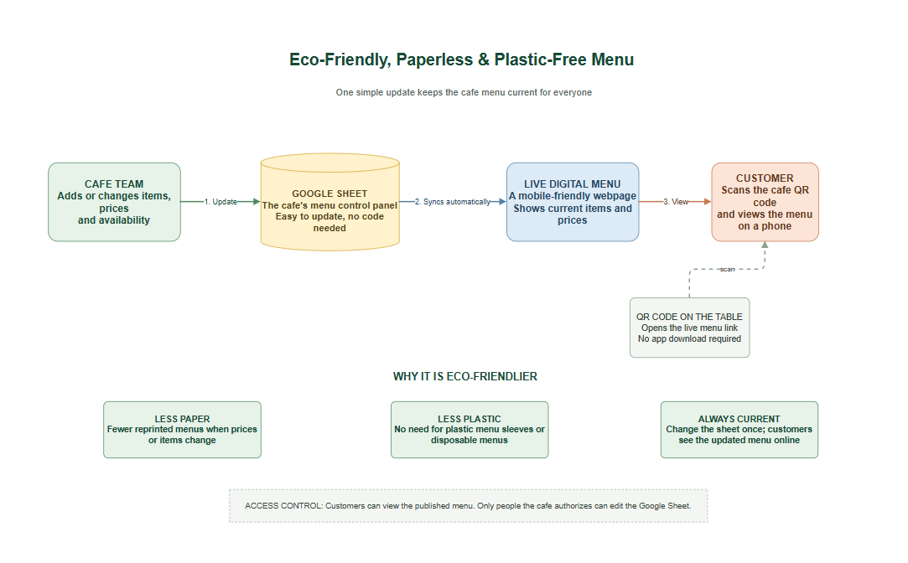

# Eco-Friendly, Paperless & Plastic-Free Menu

A digital cafe menu that helps reduce repeated paper printing and plastic menu sleeves. Cafe staff update menu items, prices, and availability in a Google Sheet; customers scan a QR code to view the current menu on their phones.

## How It Works



1. Cafe staff update the menu in the Google Sheet.
2. The published sheet feeds the live menu webpage.
3. Customers scan the cafe's QR code and view the menu on their phones. No app download is required.
4. Customers send an order with their name and email. The cafe emails UPI payment details and confirms payment after checking its bank app.

The menu is publicly viewable. Only people authorized by the cafe can edit the Google Sheet.

## Demo

[View the live menu](https://ali-akbar-kolkar.github.io/daily-grind-menu/)

## Diagram Source

[Open or download the editable Draw.io diagram](eco-friendly-paperless-menu.drawio)
[Open the editable ordering and manual-payment flow](cafe-ordering-manual-payment-flow.drawio)

---

# Development notes

Everything below is for whoever maintains this, not for customers.

## How the site is built

No build step, no bundler, no server. It is plain files deployed by GitHub Actions
(`.github/workflows/pages.yml`) to GitHub Pages.

| File | Role |
|------|------|
| `site-config.js` | Published menu URL, currency, and Apps Script Web App URL. |
| `index.html` | Page shell, cart drawer, order form, and the image URL test bench. |
| `script.js` | Fetches the CSV, renders menu cards. |
| `image-urls.js` | Works out a loadable photo URL from whatever the `Image` column holds. |
| `submit-order.js` | Sends order requests to the Apps Script Web App. |
| `order.js` | Cart, totals, customer details, and order state. |
| `style.css` | All styling. |
| `menu-images.csv` | Bundled sample sheet, used when `MENU_CSV_URL` is blank. |
| `payment-backend/Code.gs` | Apps Script order logger, email sender, and owner payment confirmation. |
| `owner-editor/` | Private Google Apps Script editor so the owner can change the sheet from a phone. |

Scripts load with `defer` in dependency order, so the Apps Script transport and `order.js` are
ready before `script.js` renders the cart buttons. If ordering is not configured, the menu
still renders and checkout explains that orders are unavailable.

PapaParse is loaded from jsDelivr. There is no build step, npm install, or lockfile.
## Ordering: Apps Script and UPI

1. The customer adds items, enters a name and email, and submits the cart.
2. The browser posts the order to Apps Script using a stable order ID so a retry cannot create a duplicate row.
3. Apps Script writes the order to the separate `Orders` sheet, emails the customer the UPI ID and payment reference, and emails the cafe an order notification.
4. The customer pays directly in a UPI app. No payment gateway or QR generator is used by the site.
5. After checking the bank app, the owner opens the email link and presses **Confirm payment received**. Apps Script updates the order and emails the customer.

There is no EmailJS integration. The Apps Script Web App URL is configured in `site-config.js`; the private Sheet ID, owner email, UPI ID, cafe name, and deployment URL are configured in Apps Script. Follow [the backend setup guide](payment-backend/README.md).

### Browser response behavior

Apps Script content responses redirect to a one-time Google-hosted URL and do not provide a configurable CORS header. The browser therefore sends a `no-cors` request and cannot read the server's result. The page says to check email before paying; the customer email is the confirmation that the order was accepted. If the request fails at the network level, the cart is retained and retry uses the same order ID.

### Limitations and guard rails

- Payment is not automatically verified. The owner must check the bank app before confirming.
- The Web App is public so the menu can submit orders. It validates inputs, limits item count and quantities, checks the submitted total against item prices, ignores honeypot submissions, and applies a 15-second per-email cooldown, but it is not a full anti-abuse service.
- Menu prices and quantities originate in the browser and can be manipulated. The cafe should verify the total against the order email and bank transaction.
- Apps Script and Gmail have daily quotas. Monitor usage if order volume grows.
- `index.html?demo=1` exercises the checkout UI without submitting an order.

## Deployment

`pages.yml` checks out the repo, optionally rewrites the `window.MENU_CSV_URL` line in
`site-config.js` from the `MENU_CSV_URL` repository variable, then publishes. Configure the
Apps Script `/exec` URL in `site-config.js` before deploying the integrated checkout.

It replaces **only that one line**, on purpose. An earlier version rewrote the whole file, which
silently deleted the currency and the entire ordering config on every deploy.

If the `MENU_CSV_URL` variable is not set, the URL committed in `site-config.js` is used as-is, so
the site still deploys correctly. If the line is missing entirely the deploy fails loudly rather
than publishing a broken config.

## Running the checks

```
node smoke-test.js
node order-test.js
```

- `smoke-test.js` — 83 checks on file-ID extraction, URL candidates, card rendering, the tally,
  the parsers, the fetch failure paths, and that the developer test bench stays hidden unless
  `?bench=1` is set.
- `order-test.js` — cart validation, Apps Script payloads, no-CORS transport, stable IDs on retries,
  pending-order recovery, the honeypot, and checks that no EmailJS or customer-side payment claim remains.

Both run the real files in a `vm` sandbox against a stub DOM and fake `localStorage`; no live Apps Script
deployment or network access is needed.

## Owner editor

`owner-editor/` is a private Apps Script web app the owner opens on their phone to edit the sheet
and save straight back to Drive. Add `?demo=1` to `owner-editor/Index.html` to try it against
in-memory rows. See [`owner-editor/README.md`](owner-editor/README.md).

Note that this repository is public, so the Apps Script server code and the sheet's column
structure are readable by anyone. Keeping the editor source private would need a separate private
repository.
